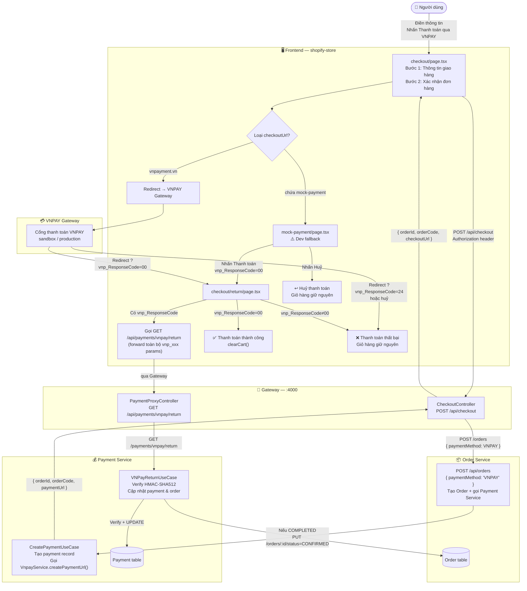

# Luồng xử lý Checkout — VNPAY

> Cập nhật: 2026-06-09

---

## Sơ đồ tổng quan



---

## Mô tả từng bước

### 1 — Checkout UI (2 bước)

Người dùng điền thông tin giao hàng ở bước 1, xem lại đơn hàng ở bước 2, rồi nhấn **"Thanh toán qua VNPAY"**.

> Bước Payment (nhập số thẻ) đã bị loại bỏ — VNPAY Gateway xử lý toàn bộ.

---

### 2 — Frontend gửi yêu cầu checkout

```
POST /api/checkout
Headers:
  Authorization: Bearer <jwt>
```

Hook `useCheckout` gọi endpoint này, nhận về `checkoutUrl`, rồi `window.location.href = checkoutUrl`.

---

### 3 — Gateway → Order Service

`CheckoutController` không xử lý VNPAY trực tiếp mà delegate sang **Order Service**:

```typescript
// gateway/src/routes/checkout.controller.ts
const result = await this.proxy.request({
  baseUrl: env.ORDER_SERVICE_URL,
  path: '/orders',
  method: 'POST',
  body: { paymentMethod: 'VNPAY' },
});
const { orderId, orderCode, paymentUrl } = result.data;
return { orderId, orderCode, checkoutUrl: paymentUrl };
```

---

### 4 — Order Service → Payment Service → VnpayService

Order Service tạo Order record, sau đó gọi **Payment Service** (`CreatePaymentUseCase`) để tạo Payment record và sinh VNPAY URL.

| Bước | Chi tiết |
|------|---------|
| **Kiểm tra credentials** | Nếu thiếu `VNPAY_TMN_CODE` / `VNPAY_HASH_SECRET` → trả mock URL |
| **Build `rawParams`** | 12 tham số chuẩn VNPAY (version, tmnCode, amount×100, txnRef, returnUrl...) |
| **Sort keys A→Z** | Bắt buộc theo chuẩn VNPAY |
| **Encode** | `encodeURIComponent(k)=encodeURIComponent(v).replace(/%20/g, '+')` |
| **HMAC-SHA512** | Sign `signData` bằng `VNPAY_HASH_SECRET` |
| **Append hash** | `vnp_SecureHash=<hex>` gắn vào cuối query string |

---

### 5 — Redirect theo môi trường

| Môi trường | checkoutUrl | Hành vi |
|-----------|-------------|---------|
| **Dev** (không có credentials) | `/checkout/mock-payment?orderId=...&amount=...` | Trang giả lập — nhấn "Thanh toán" → simulate thành công với `vnp_ResponseCode=00` |
| **Staging / Production** | `https://sandbox.vnpayment.vn/paymentv2/vpcpay.html?...` | Cổng thanh toán thật VNPAY |

---

### 6 — Return page (`/checkout/return`)

Sau khi thanh toán (thành công hoặc thất bại), VNPAY redirect browser về `${FRONTEND_URL}/checkout/return?vnp_xxx=...`.

```typescript
// return/page.tsx — useEffect
if (!isMock) {
  // Forward toàn bộ params lên backend để verify signature + cập nhật DB
  fetch(`${backendUrl}/payments/vnpay/return?${searchParams.toString()}`)
}

if (isSuccess) {      // vnp_ResponseCode === "00"
  clearCart()         // Xoá giỏ hàng — CHỈ khi thành công
}
// Cancel / fail → giỏ hàng giữ nguyên
```

| `vnp_ResponseCode` | UI hiển thị | clearCart | Backend verify |
|---|---|---|---|
| `"00"` | ✅ Thanh toán thành công | Có | Có |
| `"24"` (huỷ) | ❌ Thanh toán thất bại | Không | Có |
| Khác | ❌ Thanh toán thất bại | Không | Có |
| Không có (direct nav) | Đặt hàng thành công | Không | Không |

---

### 7 — Backend verify (`VNPayReturnUseCase`)

Frontend gọi `GET /api/payments/vnpay/return?<all_vnp_params>` → Gateway proxy sang Payment Service:

1. Lọc bỏ `vnp_SecureHash`, `vnp_SecureHashType`
2. Sort + encode lại → tính HMAC-SHA512
3. So sánh với `vnp_SecureHash` nhận được → `isValid`
4. `UPDATE payment SET status = COMPLETED | FAILED`
5. Nếu `isValid && vnp_ResponseCode=00` → gọi **Order Service** `PUT /api/orders/:id/status` → `CONFIRMED`

> **Dev mode** (không có `VNPAY_HASH_SECRET`): `checkHash = secureHash` → `isValid = true` — mock payment hoạt động end-to-end.

---

### 8 — Huỷ thanh toán

| Nguồn huỷ | Hành vi |
|---|---|
| VNPAY thật (nhấn Huỷ trên cổng) | Redirect về `/checkout/return?vnp_ResponseCode=24&...` → FailUI, giỏ hàng giữ nguyên |
| Mock payment (nhấn Huỷ) | `router.push("/checkout")` → về trang checkout, giỏ hàng giữ nguyên |

---

## Env vars liên quan

| Biến | Service | Mô tả |
|------|---------|-------|
| `VNPAY_TMN_CODE` | Gateway / Payment | Mã merchant VNPAY |
| `VNPAY_HASH_SECRET` | Gateway / Payment | Khóa ký HMAC-SHA512 |
| `VNPAY_URL` | Gateway | Endpoint cổng VNPAY (mặc định: sandbox) |
| `FRONTEND_URL` | Gateway / Payment | Base URL frontend dùng làm `vnp_ReturnUrl` |
| `ORDER_SERVICE_URL` | Gateway | URL nội bộ của Order Service |

> Khi không có `VNPAY_TMN_CODE` và `VNPAY_HASH_SECRET`, hệ thống tự động chuyển sang chế độ **mock**.

---

## Files liên quan

| File | Vai trò |
|------|---------|
| `gateway/src/routes/checkout.controller.ts` | Nhận `POST /checkout`, delegate sang Order Service |
| `gateway/src/routes/payment-proxy.controller.ts` | Proxy `GET /payments/vnpay/return` sang Payment Service |
| `gateway/src/routes/vnpay.service.ts` | Build & ký VNPAY URL (được gọi từ Payment Service) |
| `order-service/` | Tạo Order record, gọi Payment Service |
| `payment-service/.../create-payment.use-case.ts` | Tạo payment record, gọi VnpayService |
| `payment-service/.../vnpay-return.use-case.ts` | Verify signature, cập nhật DB, notify Order Service |
| `store/src/app/(store)/checkout/page.tsx` | Checkout UI 2 bước (Giao hàng → Xác nhận) |
| `store/src/app/(store)/checkout/return/page.tsx` | Trang kết quả, gọi backend verify, clear cart chỉ khi thành công |
| `store/src/app/(store)/checkout/mock-payment/page.tsx` | Trang giả lập thanh toán (dev only) |
| `store/src/hooks/useCheckout.ts` | Hook gọi `POST /checkout`, redirect tới `checkoutUrl` |
